# MindFractal Lab - Architecture

## System Overview

MindFractal Lab is a modular scientific software system for simulating and analyzing fractal dynamical systems. The architecture follows a layered design with a core computational engine and optional extensions.

```
┌─────────────────────────────────────────────────────────────┐
│                     User Interfaces                         │
│  CLI │ Python API │ Kivy GUI │ Web App │ Jupyter Notebooks  │
└────────────────────────┬────────────────────────────────────┘
                         │
┌────────────────────────┴────────────────────────────────────┐
│                   Extension Layer                           │
│  3D Model │ Trait Mapping │ C++ Backend │ Psychomapping     │
└────────────────────────┬────────────────────────────────────┘
                         │
┌────────────────────────┴────────────────────────────────────┐
│                    Core Engine                              │
│  Model │ Simulate │ Visualize │ Fractal Map │ Analysis      │
└────────────────────────┬────────────────────────────────────┘
                         │
┌────────────────────────┴────────────────────────────────────┐
│                 Foundation Layer                            │
│           NumPy │ Matplotlib │ Python stdlib                │
└─────────────────────────────────────────────────────────────┘
```

---

## Component Architecture

### Core Modules

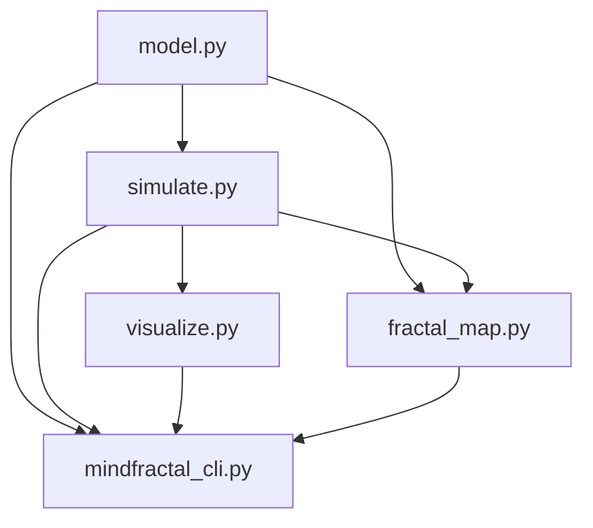

#### `model.py` - Dynamics Engine
- **Purpose**: Define and evolve the discrete-time dynamical system
- **Key Class**: `FractalDynamicsModel`
- **Responsibilities**:
  - State evolution: `step(x)`
  - Stability analysis: `jacobian(x)`
  - Chaos quantification: `lyapunov_exponent_estimate()`
- **Dependencies**: NumPy only
- **Complexity**: O(1) per step, O(n) for Lyapunov

#### `simulate.py` - Trajectory Generation
- **Purpose**: Generate and analyze orbits
- **Key Functions**:
  - `simulate_orbit()`: Core trajectory generator
  - `find_fixed_points()`: Newton's method solver
  - `compute_attractor_type()`: Classifier
  - `basin_of_attraction_sample()`: Grid-based basin
- **Dependencies**: `model.py`, NumPy
- **Complexity**: O(n_steps) for orbits, O(resolution²) for basins

#### `visualize.py` - Plotting Engine
- **Purpose**: Generate publication-quality figures
- **Backend**: Matplotlib (Agg for Android compatibility)
- **Key Functions**:
  - `plot_orbit()`: Phase portrait + time series
  - `plot_fractal_map()`: Parameter-space visualization
  - `plot_basin_of_attraction()`: State-space basins
  - `plot_bifurcation_diagram()`: Parameter sweeps
- **Dependencies**: `model.py`, `simulate.py`, Matplotlib
- **Complexity**: O(n_steps) + rendering overhead

#### `fractal_map.py` - Parameter-Space Explorer
- **Purpose**: Generate fractal maps in (c1, c2) space
- **Key Functions**:
  - `generate_fractal_map()`: Grid-based parameter sweep
  - `zoom_fractal_map()`: Self-similarity exploration
  - `adaptive_fractal_map()`: Boundary refinement
- **Dependencies**: `model.py`, `simulate.py`, NumPy
- **Complexity**: O(resolution² × n_steps)
- **Performance Critical**: Parallelization candidate

#### `mindfractal_cli.py` - Command-Line Interface
- **Purpose**: Expose functionality via CLI
- **Commands**:
  - `simulate`: Run orbit simulation
  - `visualize`: Generate plots
  - `fractal`: Compute fractal maps
  - `analyze`: Perform analysis (Lyapunov, fixed points)
- **Dependencies**: All core modules, argparse
- **Entry Point**: `mindfractal` command after installation

---

### Extension Modules

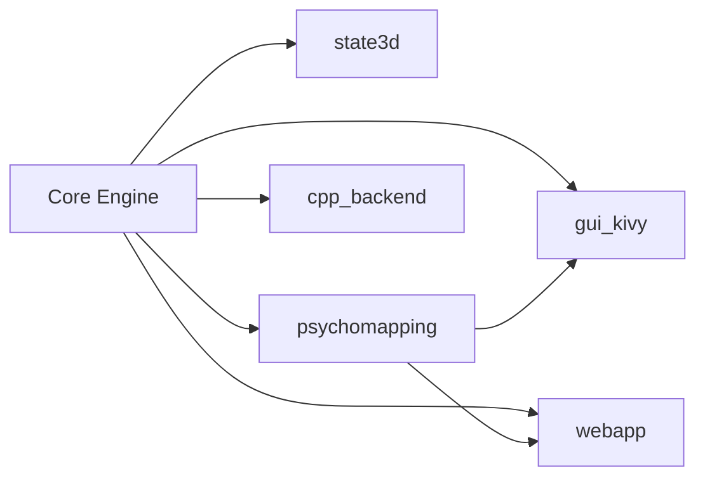

#### `extensions/state3d/` - 3D State Space
- **Purpose**: Extend to 3D dynamics (x ∈ ℝ³)
- **Modules**:
  - `model_3d.py`: `FractalDynamicsModel3D` class
  - `simulate_3d.py`: 3D orbit simulation, full Lyapunov spectrum
  - `visualize_3d.py`: 3D trajectory plots
- **Benefits**:
  - Richer attractor types (toroidal, hyperchaotic)
  - Full Lyapunov spectrum (λ1, λ2, λ3)
  - More dimensions for trait encoding
- **Trade-offs**: Higher computational cost

#### `extensions/psychomapping/` - Trait-to-Parameter Mapping
- **Purpose**: Convert psychological traits → parameter vector c
- **Modules**:
  - `trait_to_c.py`: Mapping functions
  - `traits.json`: Pre-defined trait profiles
- **Mapping**:
  ```
  openness, volatility → c1 (exploration dimension)
  integration, focus → c2 (stability dimension)
  ```
- **Use Cases**: Personalized modeling, computational psychiatry

#### `extensions/gui_kivy/` - Android/Desktop GUI
- **Purpose**: Interactive graphical interface with sliders
- **Technology**: Kivy (cross-platform)
- **Features**:
  - Trait sliders (openness, volatility, integration, focus)
  - Real-time simulation trigger
  - Orbit visualization
  - Fractal map display
- **Fallback**: Text-mode interface if Kivy unavailable
- **Target**: Android (Termux, PyDroid 3), Linux, macOS, Windows

#### `extensions/webapp/` - Web Interface
- **Purpose**: Browser-based visualization
- **Technology**: FastAPI + HTML/JavaScript
- **Architecture**:
  ```
  Browser (HTML/JS/Canvas)
      ↓ AJAX
  FastAPI Server (app.py)
      ↓
  Core MindFractal Engine
  ```
- **Endpoints**:
  - `GET /`: HTML interface
  - `POST /simulate`: Run simulation, return base64 image
  - `POST /fractal`: Generate fractal map
  - `POST /traits_to_params`: Trait conversion API
- **Benefits**: No client-side installation, shareable URLs

#### `extensions/cpp_backend/` - Performance Backend
- **Purpose**: 10-100× speedup for orbit simulation
- **Technology**: C++17 + pybind11
- **Modules**:
  - `fast_orbit.h`: C++ class declaration
  - `fast_orbit.cpp`: Optimized implementation
  - `pybind_wrapper.cpp`: Python bindings
- **Compilation**: See `build_instructions.md`
- **API**: Drop-in replacement for `simulate_orbit()`
- **Trade-offs**: Requires compilation, not pure Python

---

## Data Flow Architecture

### Simulation Pipeline

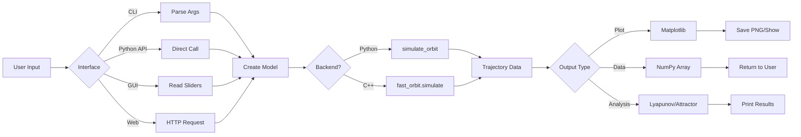

### Fractal Map Generation

```mermaid
flowchart TD
    A[Parameter Ranges] --> B[Generate Grid]
    B --> C{Parallel?}
    C -->|Yes| D[Distribute to Workers]
    C -->|No| E[Sequential Loop]

    D --> F[Per-Grid-Point Simulation]
    E --> F

    F --> G[Apply Criterion]
    G -->|divergence_time| H[Count Steps to Divergence]
    G -->|final_norm| I[Measure ||x_final||]
    G -->|lyapunov| J[Estimate λ]
    G -->|attractor_type| K[Classify Attractor]

    H --> L[Aggregate to 2D Array]
    I --> L
    J --> L
    K --> L

    L --> M[Visualize with plot_fractal_map]
```

---

## Class Diagrams

### Core Model Hierarchy

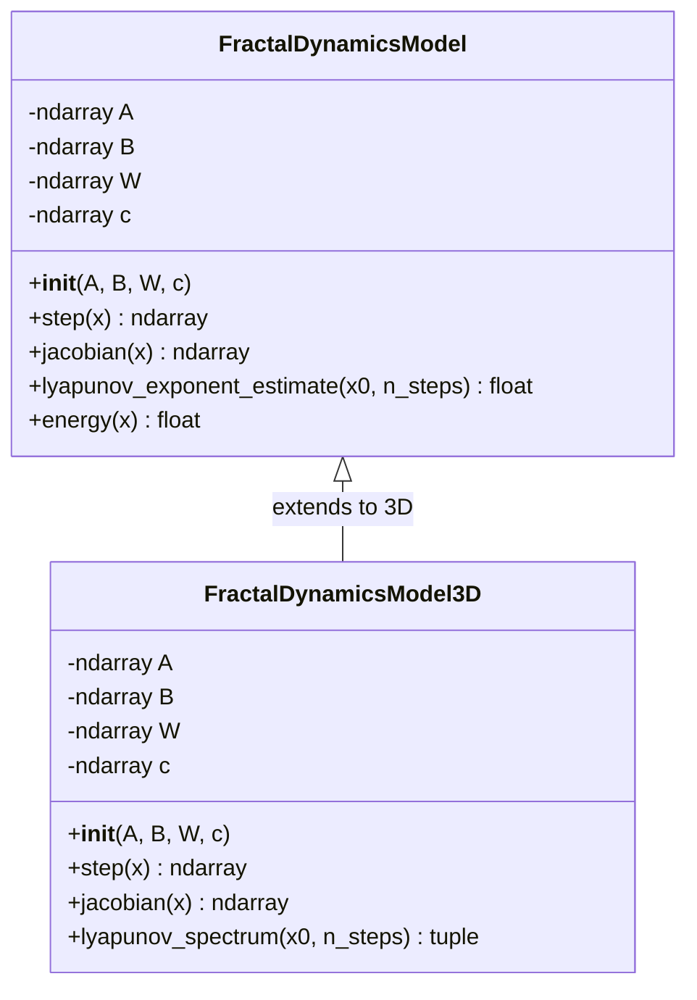

### Simulation Functions

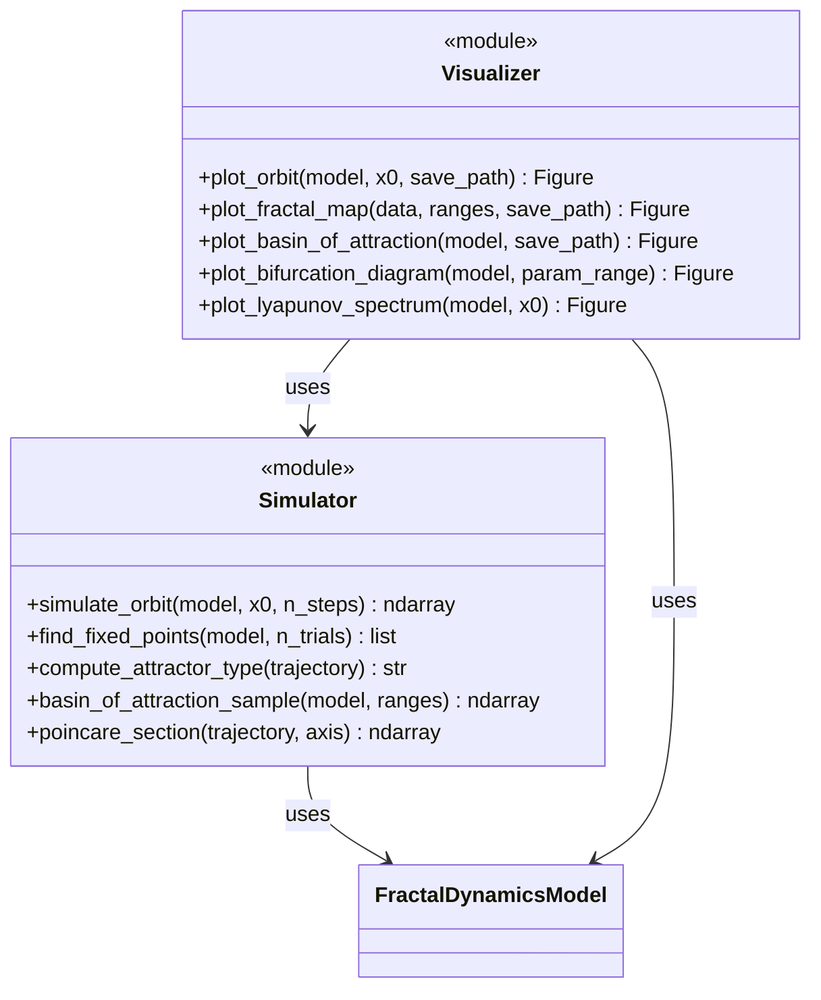

---

## State Transition Diagram

### Attractor Classification

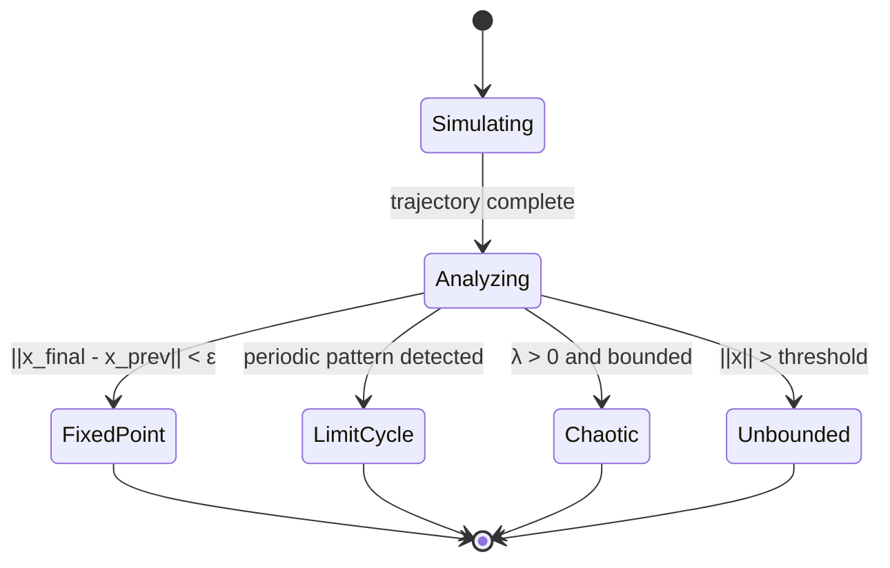

### System Dynamics

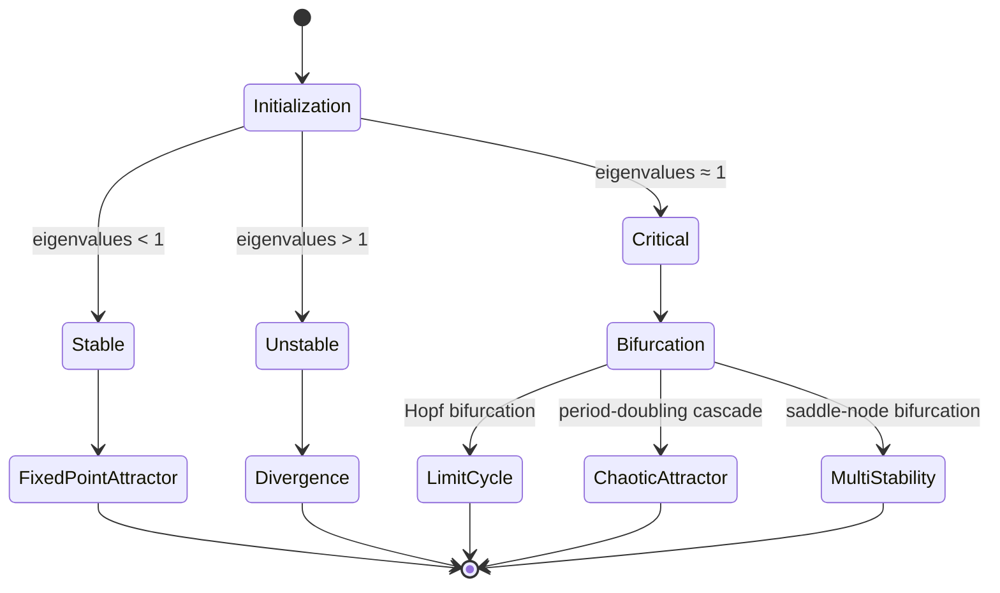

---

## Deployment Architecture

### Installation Targets

```
┌─────────────────────────────────────────────────────────────┐
│                    Desktop/Server                           │
│  Linux │ macOS │ Windows                                    │
│  Install: pip install -e . (with venv recommended)          │
└─────────────────────────────────────────────────────────────┘

┌─────────────────────────────────────────────────────────────┐
│                     Android - Termux                        │
│  pkg install python numpy matplotlib git                    │
│  git clone && pip install -e .                              │
│  CLI + Python API + webapp (via localhost)                  │
└─────────────────────────────────────────────────────────────┘

┌─────────────────────────────────────────────────────────────┐
│                   Android - PyDroid 3                       │
│  pip install git+https://github.com/USER/mindfractal-lab    │
│  Python API + notebooks (GUI limited)                       │
└─────────────────────────────────────────────────────────────┘

┌─────────────────────────────────────────────────────────────┐
│                     Web Deployment                          │
│  Docker container with FastAPI app                          │
│  Expose port 8000, serve webapp to multiple clients         │
└─────────────────────────────────────────────────────────────┘
```

### Dependency Graph

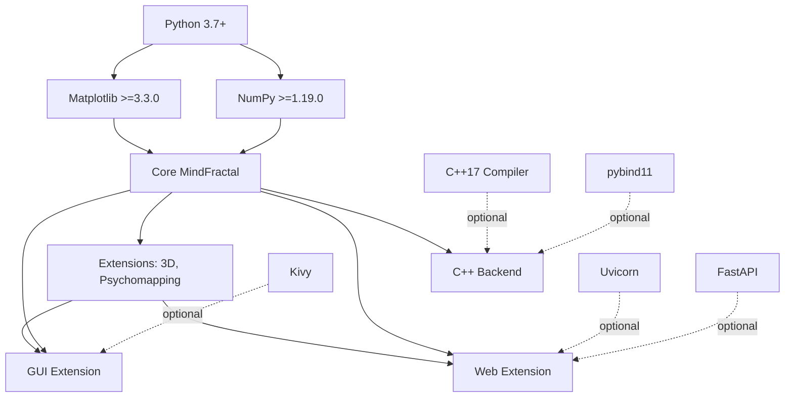

---

## Performance Characteristics

### Time Complexity

| Operation | Complexity | Notes |
|-----------|------------|-------|
| `model.step(x)` | O(1) | Single matrix-vector ops |
| `simulate_orbit(n_steps)` | O(n) | Linear in steps |
| `jacobian(x)` | O(1) | 2×2 matrix ops |
| `lyapunov_exponent(n_steps)` | O(n) | n Jacobian evaluations |
| `find_fixed_points(n_trials)` | O(n × m) | n trials × m Newton iters |
| `basin_of_attraction(res)` | O(res² × n) | Grid × simulation |
| `generate_fractal_map(res)` | O(res² × n) | Grid × simulation |
| `plot_orbit()` | O(n) | Rendering overhead |

### Space Complexity

| Data Structure | Complexity | Typical Size |
|----------------|------------|--------------|
| Model parameters | O(1) | ~100 bytes |
| Trajectory (full) | O(n × d) | n=1000, d=2 → 16KB |
| Fractal map | O(res²) | 500² × 8 bytes → 2MB |
| Basin map | O(res²) | 200² × 8 bytes → 320KB |

### Optimization Opportunities

1. **C++ Backend**: 10-100× speedup for `simulate_orbit()`
2. **Parallelization**: Fractal map rows independent → multiprocessing
3. **Adaptive Sampling**: Refine only near basin boundaries
4. **Caching**: Memoize repeated parameter combinations
5. **GPU**: Potential future work (requires CUDA/OpenCL)

---

## Security Considerations

### Input Validation

```python
# Example: validate user inputs
def validate_state_vector(x):
    if not isinstance(x, np.ndarray):
        raise TypeError("x must be numpy array")
    if x.shape != (2,):
        raise ValueError("x must be 2D vector")
    if not np.all(np.isfinite(x)):
        raise ValueError("x must contain finite values")
```

### Denial of Service Prevention

- **Limit resolution**: Cap fractal map resolution (e.g., max 1000×1000)
- **Limit steps**: Cap simulation length (e.g., max 100,000)
- **Timeout**: Add timeout for long-running operations
- **Rate limiting**: In web app, limit API requests per user

### Code Injection

- **No eval()**: Never use `eval()` on user input
- **Sanitize paths**: Validate file paths for save operations
- **Escape HTML**: In web app, escape user-provided text

---

## Testing Strategy

### Test Pyramid

```
        ┌───────────────┐
        │  E2E Tests    │  GUI workflows, CLI pipelines
        │   (manual)    │
        ├───────────────┤
        │ Integration   │  Module interactions
        │    Tests      │  (pytest)
        ├───────────────┤
        │  Unit Tests   │  Individual functions
        │   (pytest)    │  90% coverage target
        └───────────────┘
```

### Test Coverage

| Module | Target Coverage | Critical Tests |
|--------|----------------|----------------|
| `model.py` | 95% | step(), jacobian(), Lyapunov |
| `simulate.py` | 90% | orbit generation, fixed points |
| `visualize.py` | 70% | plot creation (hard to test rendering) |
| `fractal_map.py` | 85% | grid generation, criteria |
| Extensions | 70% | Core functionality |

### Test Categories

1. **Unit Tests**: `tests/test_model.py`, `tests/test_simulate.py`
2. **Regression Tests**: Ensure fixed bugs stay fixed
3. **Property Tests**: Invariants (e.g., trajectory always 2D)
4. **Performance Tests**: Benchmark critical paths

---

## Documentation & Site Architecture

### Documentation Stack

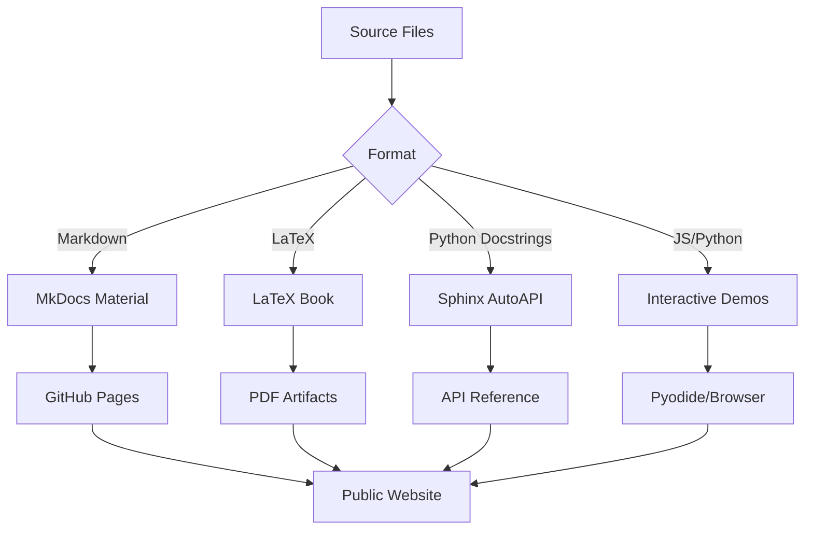

### Mathematical Layer

```
docs/math/
├── macros.tex           # Shared notation macros
├── base_model.tex       # 2D/3D real dynamics
├── cy_extension.tex     # Complex CY-inspired dynamics
├── possibility_manifold.tex  # Space of all configurations
├── embeddings.tex       # ML latent spaces
└── visualization_algorithms.tex  # Rendering algorithms
```

### Scientific Book Structure

```
docs/fractal_consciousness_book/
├── fractal_consciousness_book.tex  # Main document
├── chapters/
│   ├── 01_intro.tex
│   ├── 02_base_models.tex
│   ├── 03_cy_dynamics.tex
│   ├── 04_possibility_manifold.tex
│   ├── 05_tenth_dimension_metaphor.tex
│   ├── 06_ml_embeddings.tex
│   ├── 07_visualization_and_interfaces.tex
│   └── 08_future_work.tex
├── images/
├── Makefile
└── build_instructions.md
```

### Interactive Visualization

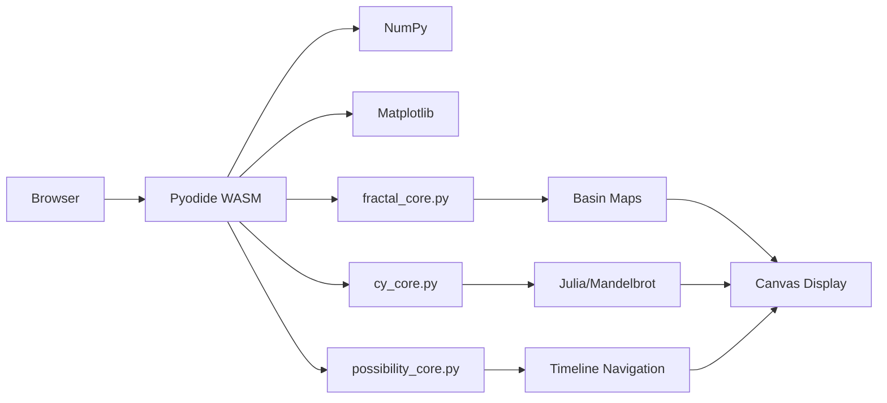

---

## CI/CD Architecture

### GitHub Actions Workflows

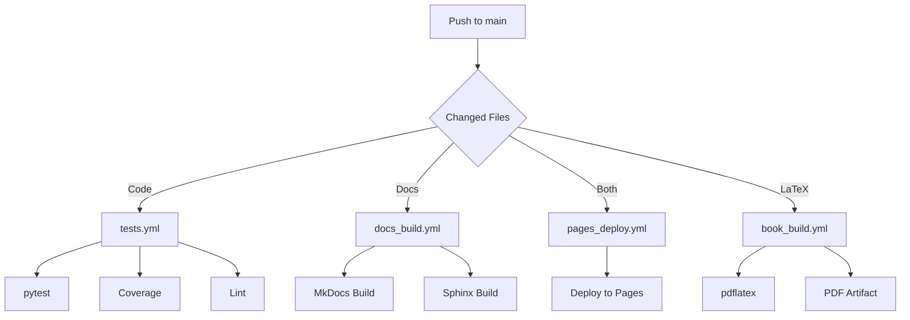

### Workflow Files

| Workflow | Trigger | Purpose |
|----------|---------|---------|
| `tests.yml` | Code changes | Run pytest, lint, type check |
| `docs_build.yml` | Doc changes | Build MkDocs & Sphinx |
| `pages_deploy.yml` | Push to main | Deploy to GitHub Pages |
| `book_build.yml` | Release/manual | Compile LaTeX book to PDF |

---

## Possibility Manifold Architecture

### Mathematical Structure

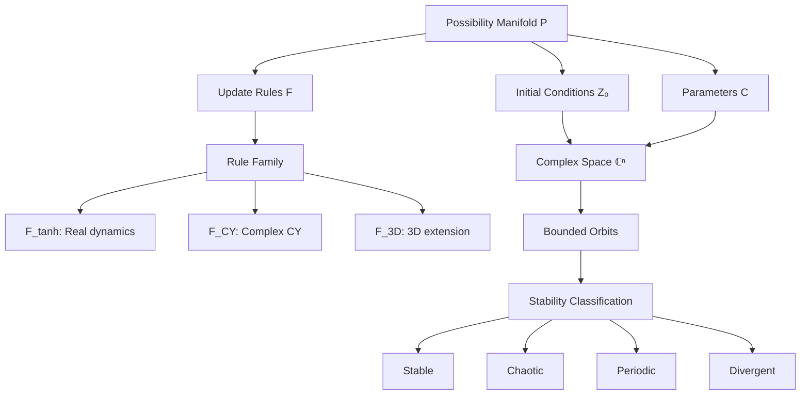

### Tenth Dimension Mapping

| Metaphor | Mathematical Object |
|----------|-------------------|
| "All possible realities" | Manifold $\mathcal{P}$ |
| "Single timeline" | Point $p \in \mathcal{P}$ + orbit |
| "Branching realities" | Bifurcation points |
| "Adjacent realities" | Nearby in $d_{\mathcal{P}}$ metric |
| "Laws of physics" | Update rule $F$ |

---

## Future Architecture Enhancements

### Phase 1: Optimization
- Parallelize fractal map generation
- GPU backend (CUDA/OpenCL)
- Compiled Python (Cython, Numba)

### Phase 2: Extensions
- Stochastic dynamics (noise-induced transitions)
- Network models (coupled agents)
- Time-varying parameters
- Optimal control (trajectory steering)

### Phase 3: Integration
- Data assimilation (fit to real EEG/behavioral data)
- ML integration (neural network parameter tuning)
- Cloud deployment (web service at scale)
- Mobile apps (native Android/iOS)

### Phase 4: Science
- Validation against neuroscience data
- Computational psychiatry applications
- Consciousness research experiments
- Publication and peer review

### Phase 5: Documentation Evolution
- Full interactive web documentation
- Video tutorials
- Jupyter Book integration
- Multi-language support

---

## Architectural Principles

1. **Modularity**: Core engine independent of extensions
2. **Extensibility**: Easy to add new extensions without modifying core
3. **Portability**: Pure Python core, optional compiled extensions
4. **Android-First**: Designed for mobile computing from ground up
5. **Performance**: Critical paths optimizable without API changes
6. **Simplicity**: Minimal dependencies, clear interfaces
7. **Reproducibility**: Deterministic (unless stochastic extension)
8. **Documentation**: Code as specification

---

## Version History

- **v0.1.0** (2025-11-17): Initial release
  - Core 2D engine
  - 5 extensions (3D, traits, GUI, webapp, C++)
  - Complete documentation
  - Android compatibility

---

**Architecture Document Version**: 1.0
**Last Updated**: 2025-11-17
**Author**: MindFractal Lab Contributors
