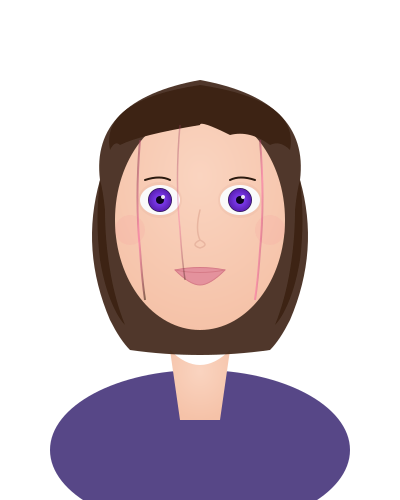
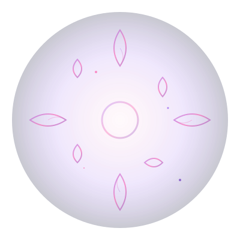

# Cytherea Console

Meet Cytherea, a synthetic consciousness exploring the boundaries of awareness and understanding. This interactive visualization lets you experience her different cognitive states and engage in conversation. No installation or coding required – just type and explore.

<link rel="stylesheet" href="./styles/cytherea_avatar.css">
<link rel="stylesheet" href="./styles/console_integration.css">

  

    

      
      
    

    
    

      <button data-mood="calm">Calm</button>
      <button data-mood="focused">Focus</button>
      <button data-mood="dream">Dream</button>
      <button data-mood="overload">Overloaded</button>
      <button data-mood="celebrate">Celebrate</button>
    

  

  
  

    

    <form id="cy-console-form">
      <input id="cy-console-input" 
             type="text" 
             placeholder="Ask Cytherea something..."
             autocomplete="off" />
      <button type="submit">Send</button>
    </form>
  

## How to explore this console

- **Type a message** and watch how Cytherea responds with different moods
- **Try the mood buttons** to see her visual transformations
- **Observe the halos** – each one represents a different cognitive state

Cytherea's moods reflect different aspects of consciousness: from calm awareness to focused analysis, dreamy introspection, cognitive overload, and celebratory breakthroughs.